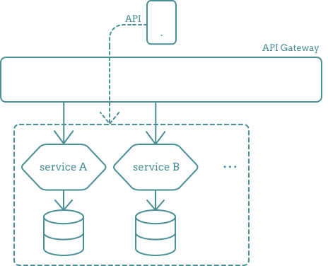
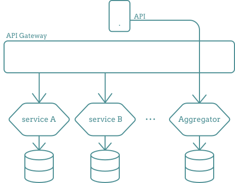
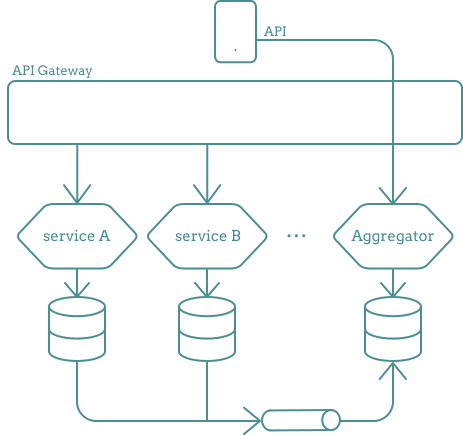

# Aggregate pattern language

##  situation

In a microservice architecture, each microservice is responsible for its own data.

However, there are cases where clients need to display data that is aggregated from multiple microservices.

If the number of microservices from which we need to aggregate the data is large,
having numerous separate API calls is not a good idea.

So, we cannot use [API Composition](<https://github.com/Bright98/microservices-pattern-language/blob/main/quering/API-composition.md>) for aggregation.

##  problem

Each service has its own schema and database, and each individual request takes some time.

Therefore, retrieving data from each service synchronously one by one and aggregating them would consume a significant amount of time.

##  solution

To handle this situation, it is necessary to create an **aggregate microservice**.

- The **Aggregate** service is an independent deployable microservice that possesses its own data and database.
- Its database consistently maintains the aggregated data obtained from other services.
- When a client requires aggregated data, they can retrieve it directly from the **Aggregate** service.

##  challenge

#### How does the aggregator database consistently maintain the aggregated data?

- The aggregate database establishes an asynchronous relationship with other microservices through a queue.
- In the other services, whenever there is a change in data, a message is published and the data is pumped through the queue.
- The aggregate service continuously listens for messages from other services.
Upon receiving a message, it updates its database accordingly.

So, the aggregation service always maintains the aggregated data in its database.

>  To ensure data consistency, we can utilize the _acknowledgement_ or _checksum pattern_:
>
> The aggregator is responsible for sending an acknowledgment to the sender service upon receiving the data,
> and then proceeds to commit the data.

##  challenge2

#### Are we duplicating the data? Yes!
The aggregator accumulates data from other services,
but we require this service to minimize the number of requests.

##  benefits

- The client makes a single API call and receives aggregated data, resulting in a quicker response time.
- The aggregator possesses knowledge about data that individual microservices are unaware of.

##  related pattern language

-   [API Composition](<https://github.com/Bright98/microservices-pattern-language/blob/main/quering/API-composition.md>)

##  links

- https://www.youtube.com/watch?v=fZkMxA_TKS4
