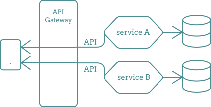
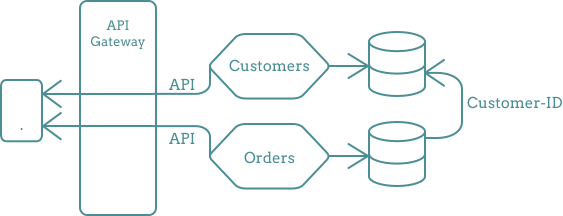
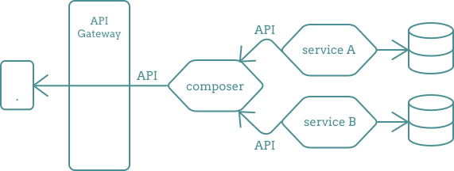
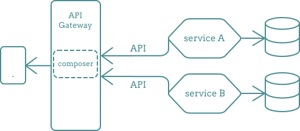

# API Composition patten language

In a microservice architecture, each microservice is responsible for its data in the database and its APIs.

However, sometimes clients need to display data **that is aggregated from multiple microservices**.

##  situation

Imagine this situation:
We have an e-commerce application with two microservices:
**Orders** and **Customers**.

The **Customers** microservice stores customer information,
while the **Orders** microservice handles customer orders.

To maintain the relationship between orders and customers, the Orders microservice stores the **customer ID**.

If we want to retrieve the orders of a specific customer along with their information, the client needs to make **two** API calls.

One call is made to retrieve the customer information, and another call is made to retrieve the orders of the customer.

The client then aggregates the data from these two APIs.

##  problem

- Each API must pass through the **API Gateway** to reach the client.
- Sometimes, we **don't need all the data** from one of the APIs.
- The client must handle multiple and disparate API responses.

##  solution

We should create the **API Composition service** that sits between clients and the underlying APIs.

This service will handle:
- The communication with the individual APIs,
- Making the necessary API calls
- Aggregating data or functionality from multiple sources.

This will allow clients to **interact with a single API** instead of making multiple API calls to different services..

##  benefits

- Simplified for clients: Clients interact with a single API.
- Tailored functionality: API Composition aggregates and sends the required data from the APIs.
- Optimized performance: By fetching and aggregating data from multiple sources.
- Flexibility: The composition layer can evolve independently, enabling changes in the underlying services without affecting clients.

##  more performance

If the number of composition APIs continues to grow and becomes excessive, we can`t rely on API composition.
In such cases, it would be better to consider an alternative approach, such as using an Aggregator service.

##  challenge

We can consider handing over the composer layer to the **API Gateway**, but this decision depends on various factors.

It should be based on the specific requirements, scale, and complexity of your system.

Putting the composer in the API Gateway could be a good idea because the API Gateway offers several advantages, like:
- Grate security
- traceability
- caching
- centralizing control
- ...

However, there are some serious issues to consider when putting the composer layer in the API Gateway:

- Imagine the composer needs to compose APIs from multiple services.
  What should the Gateway do if something goes wrong in the middle of composition?
  Should it respond with an error or return flawed data?
- If we need to change something in the composer layer, we have to **deploy the entire gateway** after the changes are made.

 So, make your decision based on the requirements of your application.

