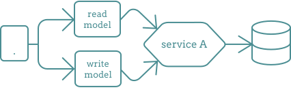
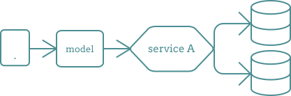
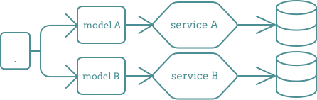
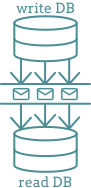

# CQRS patten language

In microsevice architecture most of time we have 1 database that respond both query and update operation.
In other words working for both complex join query, and CRUD operation.

##  situation

Imagin the situation that your app:

-   required some query to join more than 10 tables -> This will lock DB for latency of query computation !
-   because of complex database model and complex validation, CRUD operation will take a long time.

##  problem

Read and write have different concerns.
When we do write to a DB, we write **entities**
but when do reads we read **aggregated** data, not entity base model.

##  solution

Operations that we do in our database are: READ, WRITE, UPDATE, DELETE

-   `read` called:
    **_Query_**, **_aggregation data grid_** or **_presentation object_**
-   `write, edit, delete` called:
    **_commands_**. or **_entity based model_**

### Steps:

**1.** seperate Query and Command models.
(seperate aggregate model from entity base model)

 Good for validation in CRUD operation. But it dosn`t really optimize the database

**2.** split database to read and write DB.
This step, optimizing our databases.

#### best solution

**3.** split microservice into 2 microservices.
each microservice has own model, own database, ...

##  so

##### CQRS: Command Query Responsibility Segregation.

CQRS always have 2 side: read, write

-   in write side: send command or events which are store reliably.
-   in read side: is where you run queries to get data back.

##  problem 2

How to sync two databse and keep sync always?

##  solution

Using event-driven architecture:
When something update in write databa, publish message.
These message consume by read database, then update itself.

##  challenge

Data consistency: because of using meesage, data not reflected immidiately.

##  some other benefits

-   We can scale each database independently.
    for example: if our app is **read-inactive**, we can focuse on read DB and scale only read DB.
-   Doing computation when the data is written not at the time it is read.
-   Each computation in done just once. No matther how many times the value is read.

> **read-inactive** : if our app is mostly reading use case and not writing so much

##  more performance

Read DB can use its cache to return data faster.
Every time read DB get message from command DB, update itself. Cache can be updated too.
And always reading data happens from cache.

##  related pattern language

-   event sourcing

##  links

-   https://medium.com/design-microservices-architecture-with-patterns/cqrs-design-pattern-in-microservices-architectures-5d41e359768c
-   https://www.youtube.com/watch?v=lg6aF5PP4Tc&t=13s
-   https://www.youtube.com/watch?v=pUGvXUBfvEE
